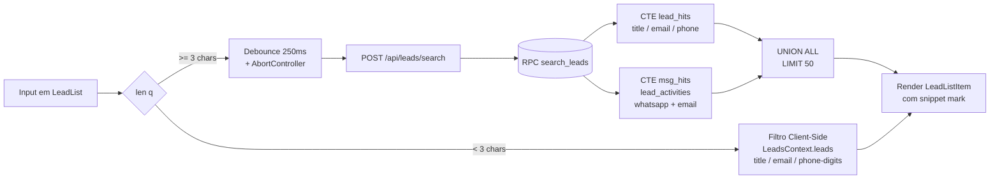

# 🏛️ Atlas Eye CRM — Arquitetura Técnica

**Status:** ✅ Produção / Live
**Data:** 2026-03-12
**Versão:** 2.0 (Modern SPA Architecture)

O Atlas Eye é estruturado em três camadas claras: **Client (SPA)**, **API Gateway (Next.js App Router)** e **Data Layer (Supabase)**. Toda a comunicação obedece restritamente políticas de multilocação (Tenant Isolation).

---

## 1. Diagrama de Arquitetura de Alto Nível

```mermaid
graph TD
    %% Cliente
    subgraph Client [Frontend / SPA (React 19 + Next.js)]
        UI[UI Components]
        Hooks[Custom Hooks Data Layer]
        subgraph Realtime [WebSockets]
            WS[Supabase Realtime Channel]
        end
    end

    %% B2B / Automation
    subgraph External [External Actors]
        N8N[n8n Community Node]
        WBA[WhatsApp / Z-API Webhooks]
    end

    %% API Gateway / Auth Layer
    subgraph NextJS [Next.js API Gateway (/api)]
        Auth[API Auth Guard]
        Routes[API Routes]
    end

    %% Edge Functions
    subgraph Edge [Supabase Edge Functions]
        EF1[chat-webhook-inbound]
        EF2[invite-member / manage-member]
        EF3[generate-ai-insights]
    end

    %% Data Layer
    subgraph Database [PostgreSQL (Supabase)]
        RLS[Row Level Security]
        Tables[(25 Tables)]
        Triggers[DB Triggers]
    end

    %% Conexões Frontend
    UI <-->|State/Props| Hooks
    Hooks -->|Client Fetch| Database
    Database -.->|Changes| WS
    WS -.->|Reactive Update| Hooks

    %% Conexões API
    External -->|Token Bearer atl_* | NextJS
    UI -->|Next.js Auth JWT| NextJS
    NextJS -->|Service Role Bypass| Database

    %% Conexões Webhooks & Serverless
    WBA -->|No-JWT POST| EF1
    EF1 --> Database
    Database -.->|HTTP Request| N8N
```

---

## 2. Padrões de Comunicação

### 2.1 Leitura de Dados (Frontend)
Para eficiência máxima e refetch instantâneo, os *Hooks do React* consultam o banco do Supabase **diretamente** pelo Cliente, valendo-se das políticas RLS que impedem vazamento de tenants.

Exemplo de Fluxo (Leitura de Leads):
1. O usuário abre o Kanban.
2. O `useLeads()` executa `.from('leads').select().eq('organization_id', orgId)`
3. O Supabase avalia o token JWT e a RLS `is_org_member()`, retornando apenas os cards corretos.

### 2.2 Escrita e Ações Complexas
Para ações complexas, envio de notificações sistêmicas, ou gestão de administradores, o Frontend confia nas **API Routes** do Next.js.
1. O componente envia um POST para `/api/leads`
2. O middleware/API verifica o Auth
3. Usa-se a *Service Role* para contornar RLS onde as regras seriam convolutas (ex: criar workspace ou convite de membro), porém, `organizationId` é sempre imposto hardcoded no script.

### 2.3 Integrações Externas (O "Headless CRM")
O Atlas Eye possui um modelo "Headless" consumível pelo n8n via API Tokens.
1. O n8n envia header `Authorization: Bearer atl_xxxx`
2. As API Routes (Next.js) recebem, executam hash `SHA-256`, comparam na tabela `api_tokens` e decodificam o `organization_id`.
3. Todos os DMLs são aplicados no Tenant correto.

---

## 3. Isolamento Multi-Tenant e RLS (Row Level Security)

A proteção primária dos dados se dá pela tabela de junção `organization_members`.

1. **Autenticação:** Ocorre no `.auth.users`.
2. **Autorização:** A Policy RLS em `leads` é:
   ```sql
   CREATE POLICY leads_org_isolation ON leads FOR ALL
   USING (
     organization_id IN (
       SELECT organization_id FROM organization_members
       WHERE user_id = auth.uid() AND status = 'active'
     )
   );
   ```
3. **Chaves Estrangeiras:** O modelo utiliza chaves compostas seguras contra fraude de Inserção. Exemplo: Para um membro mover um lead para um funil, o DB checa se `lead.org_id == pipeline.org_id`.

---

## 4. Supabase Edge Functions (Serverless)

A lógica assíncrona pesada (Deno/Edge) ocorre fora das requisições principais do Next.js:

- `chat-webhook-inbound`: Endpoint desprotegido (sem verificação JWT) que recebe Webhooks de Provedores de WhatsApp. Ele mapeia os clientes pelo telefone, cria/atualiza leads instantaneamente e grava na `lead_activities`. O Webhook devolve um status 200 pro Z-API em milissegundos, evitando retries.
- `generate-ai-insights`: Escuta por webhooks assíncronos (Database Webhooks) via `webhook_logs` e dispara prompts à OpenAI, populando a `lead_ai_insights` e emitindo update visível no chat.
- `manage-member`: Contorna RLS severo de deleção/edição para gerenciar RBAC sem risco.

---

## 5. Arquitetura UI Múltipla (Kanban e Inbox)

A unificação de fluxos resolve o problema de fragmentação:
- A tela **`/pipeline`** mapeia os Leads horizontalmente por estágio.
- A tela **`/chat`** mapeia *os mesmos Leads*, ordenados por atividade mais recente (como no WhatsApp).
Ambas reagem à inserção em `lead_activities` via **Supabase Realtime**. Se um membro enviar uma mensagem pelo computador A no Chat, a timeline de atividades no Kanban do computador B renderiza a bolha animada simultaneamente.

---

## 6. Busca de Leads — Filtro Híbrido Cliente/Servidor

**Status (2026-04-13):** backend aplicado no Supabase de produção e validado com 13 smoke checks. Frontend implementado em 7 arquivos (`types.ts`, `utils.ts`, `api/leads/search/route.ts`, `hooks/useLeadSearch.ts`, `hooks/index.ts`, `LeadListItem.tsx`, `LeadList.tsx`); type-check limpo. QA manual no navegador é o último passo antes do shipped.

A barra de busca da sidebar do Chat (`LeadList`) opera em dois modos, escolhidos dinamicamente pelo comprimento do termo digitado. Esse desenho elimina dois bugs históricos: (a) buscas que falhavam em leads fora do *cap* default de 1000 linhas carregadas em `LeadsContext`, e (b) misses por acentuação (`Alcinéia` vs `Alcineia`) e por telefone não-normalizado.



### 6.1 Modos de Operação

- **Client-side (`q < 3`):** filtragem instantânea em memória sobre `LeadsContext.leads`, sem requisições. Cobre `title`, `email` e `phone` normalizados (somente dígitos).
- **Server-side (`q >= 3`):** debounce de 250 ms, cancelamento da requisição anterior via `AbortController`, e descarte de respostas fora-de-ordem por *request-id*. Falha de rede faz *fallback* para o modo client-side com toast informativo.

### 6.2 Camada de Banco

A RPC `search_leads` (`SECURITY INVOKER`, preserva RLS) executa um `UNION ALL` de duas CTEs:
- `lead_hits`: `ILIKE` sobre os campos de contato (`title`, `email`, `phone`-digits).
- `msg_hits`: `ILIKE` sobre `lead_activities.content` filtrado por `type IN ('whatsapp','email')`, com `DISTINCT ON (lead_id)` para deduplicar por lead, mantendo o snippet do match mais recente.

A normalização *accent/case-insensitive* é feita por funções `IMMUTABLE` (`norm_text` usando `unaccent` + `lower`, e `leads_phone_digits`), permitindo índices de expressão **GIN trigram** (`pg_trgm`) sobre as colunas pesquisadas. Optou-se por trigram em vez de *full-text search* com *stemming* para evitar a complexidade de dicionários multilíngues e manter o custo previsível em cada *keystroke*.

### 6.3 Ranking e Renderização

Os resultados são ordenados na UI segundo a hierarquia: **pinned > match em contato > match em mensagem > recência (`last_activity_at`)**. Quando o match ocorre no conteúdo de uma mensagem, o `LeadListItem` renderiza um trecho (~60 chars) centrado na ocorrência, com o termo destacado por `<mark>` — o snippet é HTML-escapado antes da injeção, garantindo segurança do `dangerouslySetInnerHTML`.

### 6.4 Limites e Permissões

- `LIMIT 50` sem paginação (v1).
- A flag de permissão `leads.view_own_only` é repassada à RPC como defesa em profundidade, complementando o RLS já aplicado às tabelas `leads` e `lead_activities`.
- A rota legada `/api/leads?q=` permanece intacta, servindo o `GlobalSearch`.

Detalhes completos (DDL dos índices, corpo da RPC, contratos da rota e do hook `useLeadSearch`) em `docs/superpowers/specs/2026-04-13-lead-filter-design.md`.
