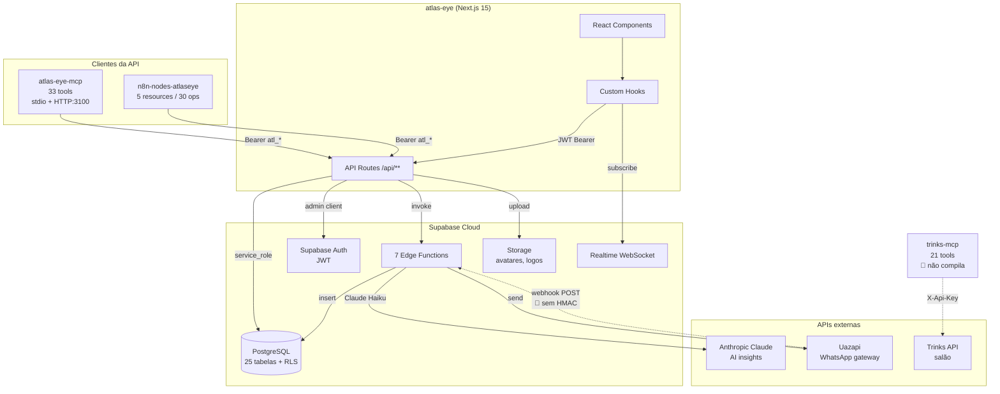

# Atlas Eye — Arquitetura end-to-end

## Diagrama de componentes

---

## Componentes e responsabilidades

| Componente | Papel | Consumidores |
|---|---|---|
| `atlas-eye/` | App principal + fonte da verdade da API REST | Usuários via browser |
| `atlas-eye-mcp/` | Expõe API como tools para LLMs / AI agents | Claude Desktop, Cursor, n8n AI Agent |
| `n8n-nodes-atlaseye/` | Integra Atlas Eye em workflows n8n | Workflows automation |
| `supabase/functions/` | Lógica que exige secrets server-side (IA, WhatsApp, invites) | Atlas Eye API, webhooks externos |
| `database/` | Schema + RLS + RPCs | Supabase (single DB) |
| `trinks-mcp/` | Integra Trinks API de salão (independente) | (pretendido) Claude/n8n |

---

## Tabela de endpoints REST

Todos exigem `Authorization: Bearer <jwt | atl_*>` salvo indicado. Mutations devem incluir `source: "ai_agent" | "n8n" | "human" | "system"` para auditoria.

### Leads
| Método | Path | Consumido por |
|---|---|---|
| GET | `/api/leads` | MCP, n8n, Frontend |
| POST | `/api/leads` | MCP, n8n, Frontend |
| GET | `/api/leads/[id]` | MCP, n8n, Frontend |
| PATCH | `/api/leads/[id]` | MCP, n8n, Frontend |
| DELETE | `/api/leads/[id]` | MCP, n8n, Frontend |
| GET/POST | `/api/leads/[id]/messages` | MCP, n8n, Frontend |
| GET/POST | `/api/leads/[id]/history` | MCP, n8n, Frontend |
| GET/PATCH/DELETE | `/api/leads/history/[event_id]` | MCP, n8n |

### Pipelines e stages
| Método | Path | Consumido por |
|---|---|---|
| GET/POST | `/api/pipelines` | MCP, n8n, Frontend |
| GET/PATCH/DELETE | `/api/pipelines/[id]` | MCP, n8n |
| GET | `/api/pipelines/[id]/stages` | n8n, Frontend |
| POST | `/api/pipelines/stages` | MCP, n8n |
| GET/PATCH/DELETE | `/api/pipelines/stages/[stage_id]` | MCP, n8n |
| GET | `/api/pipelines/stage-colors` | n8n, Frontend |

### Outros recursos
| Método | Path | |
|---|---|---|
| GET/POST | `/api/tags` | MCP, n8n, Frontend |
| GET/POST/PATCH/DELETE | `/api/custom-fields[/id]` | Frontend (principal) |
| GET/POST/PATCH/DELETE | `/api/users[/member_id]` | MCP, n8n, Frontend |
| GET/POST/PATCH | `/api/notifications` | MCP, Frontend |
| POST | `/api/auth/setup-owner` | Onboarding (setup_token) |
| POST | `/api/admin/create-workspace` | Admin (JWT superadmin) |
| DELETE | `/api/admin/delete-workspace` | Admin (JWT superadmin) |
| GET | `/api/docs` | Documentação Scalar |

---

## Contratos de dados

### Inconsistência crítica: `title` vs `name`
- **DB:** coluna `leads.title`
- **API response:** remapeia para `name`
- **MCP / n8n:** param `name`

**Sintoma:** qualquer dev lendo `types.ts` sem ler a rota `/api/leads/route.ts` cria confusão. Fix: renomear coluna ou documentar no README.

### Owner do lead
- **DB:** `owner_member_id`
- **API / MCP / n8n:** `assigned_to`

Mesmo problema — remapeamento invisível.

### Custom fields
- **DB:** `custom_attributes jsonb`
- **API:** remapeia para `custom_fields` (array)

### IDs
- Atlas Eye: UUID para tudo.
- Trinks: `int` para agendamentos/clientes/etiquetas. Incompatível — qualquer bridge exige tradução.

---

## Realtime

**Infraestrutura pronta, cliente não implementado.** Supabase Realtime está habilitado para `leads` e `lead_activities`. O hook `useLeads` subscreve com fallback quando JOIN falha. Nenhum outro cliente (MCP, n8n) escuta — oportunidade para notificar agents de mudanças em tempo real.

---

## Edge Functions

| Function | Trigger | Auth | Risco |
|---|---|---|---|
| `chat-webhook-inbound` | POST webhook Uazapi | **🔴 nenhum** | Spoofing |
| `chat-send-message` | HTTP POST do app | Bearer | 2 TODOs, integração incompleta |
| `fetch-avatar` | HTTP POST | Bearer | OK |
| `generate-ai-insights` | HTTP POST | Bearer | Consome Anthropic API |
| `invite-member` | HTTP POST | Bearer | OK |
| `manage-member` | HTTP POST | Bearer | OK |
| `accept-invite` | HTTP POST | token | OK |

---

## Duplicação de lógica (DRY violations)

| Lógica duplicada | Locais | Sugestão |
|---|---|---|
| HTTP client com Bearer auth | `atlas-eye-mcp/src/http-client.ts`, `trinks-mcp/src/http-client.ts`, `n8n-nodes-atlaseye/nodes/AtlasEye/transport.ts` | Extrair `packages/api-client` |
| Types Lead/Pipeline/Stage | `atlas-eye/src/lib/types.ts` (apenas) — MCP e n8n reinventam via zod/INodeProperties | Gerar via `supabase gen types` + compartilhar |
| Validação de UUID | Regex em múltiplas rotas | Helper `assertUUID(value)` |
| Auth middleware | `authenticateRequest` replicado em cada route | `withAuth(handler)` HOF |

---

## Fragilidades de integração

| Ponto | Problema | Impacto |
|---|---|---|
| Sem versionamento de API | `/api/leads` sem `/v1` | Mudança quebra MCP e n8n simultaneamente |
| Sem idempotency-key | POST retry duplica | Leads duplicados |
| Sem retry com backoff | Clientes não retentam | Falhas transitórias viram erro final |
| Sem circuit breaker | Loop direto no Uazapi | Falha externa cascateia |
| `source` não injetado automaticamente em n8n | Auditoria quebrada | Não dá pra rastrear origem de mutação |
| Edge function sem HMAC | Webhook spoofable | Injeção de mensagens falsas |

---

## Recomendações

1. **Criar `packages/api-client`** compartilhado (TypeScript) com zod schemas de Lead/Pipeline/Stage/Tag como single source of truth.
2. **Versionar a API** (`/api/v1/**`) antes do próximo breaking change.
3. **Gerar tipos do Supabase** automaticamente: `supabase gen types typescript > atlas-eye/src/types/database.ts`.
4. **Padronizar `source`** como header `X-Source` em vez de campo no body — middleware injeta automaticamente.
5. **HMAC em todos os webhooks** inbound.
6. **Idempotency-Key** em POST de leads/messages.
7. **Decidir destino do trinks-mcp**: completar com integração ao atlas-eye (tradução int↔UUID) ou arquivar.
